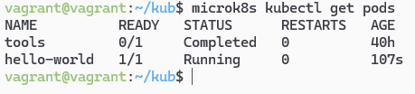
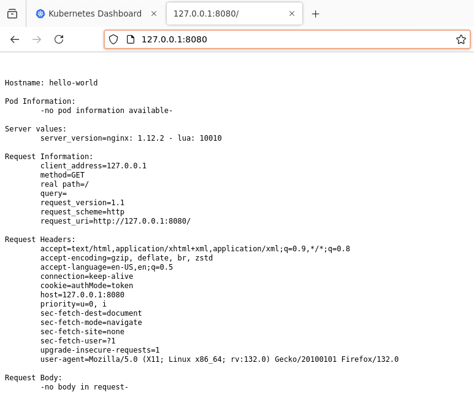
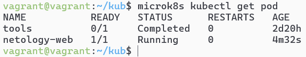
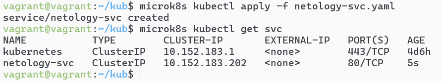
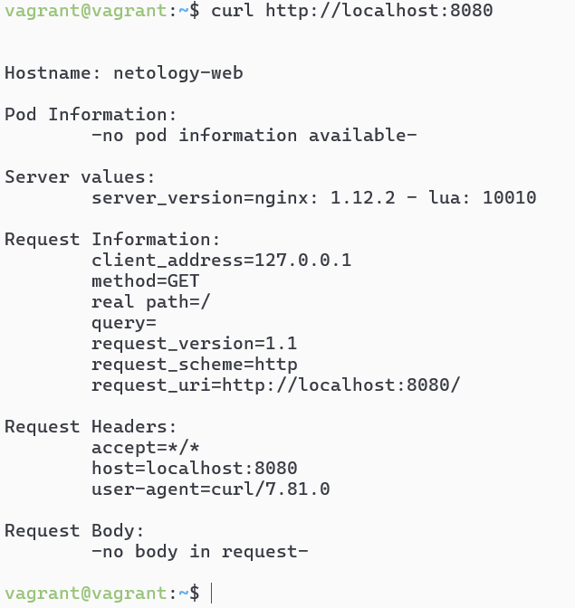

# Домашнее задание к занятию «Базовые объекты K8S»- Михалёв Сергей

### Цель задания

В тестовой среде для работы с Kubernetes, установленной в предыдущем ДЗ, необходимо развернуть Pod с приложением и подключиться к нему со своего локального компьютера. 

------

### Задание 1. Создать Pod с именем hello-world

1. Создать манифест (yaml-конфигурацию) Pod.
2. Использовать image - gcr.io/kubernetes-e2e-test-images/echoserver:2.2.
3. Подключиться локально к Pod с помощью `kubectl port-forward` и вывести значение (curl или в браузере).

**Решение**

Создал манифест [hello-world-pod.yaml](manifests/hello-world-pod.yaml). Запустил командой `microk8s kubectl apply -f hello-world-pod.yaml` 
Проверил список подов. 
 
Проверил работу nginx через браузер. 
 

------

### Задание 2. Создать Service и подключить его к Pod

1. Создать Pod с именем netology-web.
2. Использовать image — gcr.io/kubernetes-e2e-test-images/echoserver:2.2.
3. Создать Service с именем netology-svc и подключить к netology-web.
4. Подключиться локально к Service с помощью `kubectl port-forward` и вывести значение (curl или в браузере).

**Решение**

Создал манифест [netology-web.yaml](manifests/netology-web.yaml) 
Проверил список подов. 
 
Создал манифест [netology-svc.yaml](manifests/netology-svc.yaml) 
Проверил список сервисов. 
   

Проверил подключение через curl 
 

Проверил в браузере 
 

------

